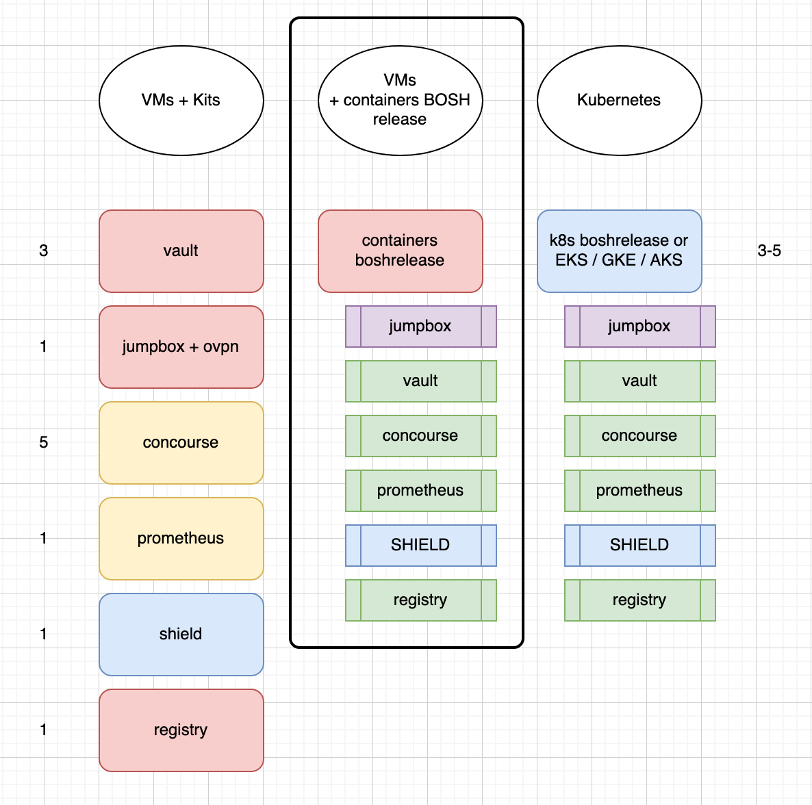

Experimental

Looking to create a control plane for building applications either with Cloud Foundry and Kubernetes. What makes this different from other control planes is
we are trying to minized cost and integrate docker images.



Used a self signed cert generated by

```
openssl req \
  -newkey rsa:4096 -nodes -sha256 -keyout certs/domain.key \
  -x509 -days 365 -out certs/domain.crt
```
Make has two targets
merge 
deploy

The merge creates a file called cp-deploy.yml used by makefile target deploy
